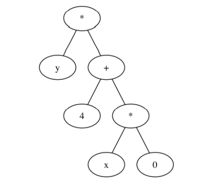

#### Calculate

###### A fully functional program to simplify, transform and evaluate expressions involving any of these operands:

- \+ (addition)
-  \- (subtraction)
- \* (multiplication)
- / (division)

---

Binary trees are a natural representation of arithmetic expressions. 
For instance, the expression y * (4 \+ x * 0) can be represented by the following tree: 

:


Given an expression in either infix or postfix form, the program will construct an appropriate Binary tree for the expression. The program will then use the tree to implement the main functionalities and print the result. 

###### These functionalities are: 

1. Tranform and display the expression in Postfix notation 
2. Tranform and display the expression in Prefix notation 
3. Transform and display the expression in Infix notation (fully parenthesized)
4. Simplify and display the simplified form of the given expression 
5. If variables (i.e. x, y, z...) are present in the expression, the program will ask the user to assign **integer** values to each variable and will proceed to evaluate the expression 
6. If no variables are present, the program will proceed to evaluate the expression 

---


###### To run: _Java Calculate_


###### Example output for the expression above:

```
Type p for postfix or i for infix: i
Please type your expression (with a single space between each token): y * ( 4 + x * 0 )
Postfix: y4x0*+*
Prefix: *y+4*x0
Infix: (y*(4+(x*0)))

Simplified: (y*4)

Please assign integer values to the variables:
x = 3
y = 4

The expression evaluates to: 16
The simplified expression evaluates to: 16
Would you like to reassign the variables (y/n)? n
Would you like to type another expression (y/n)? y
```


